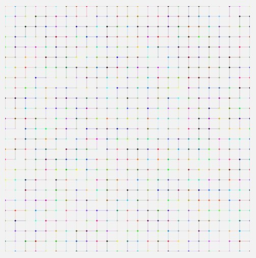
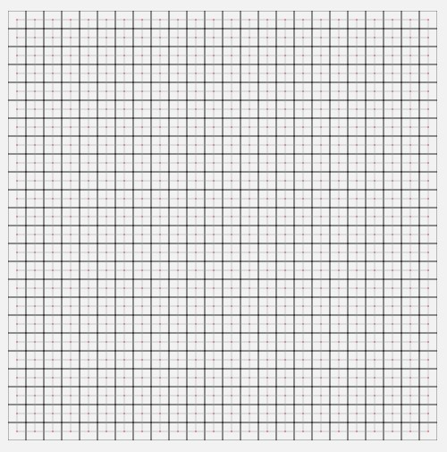

# Assignment A2: Mesh Generator

  - Ali Virk [virka9@mcmaster.ca]
  - Hamza Abou Jaib [aboujaih@mcmaster.ca]
  - Qamrosh Ahmad [ahmadq2@mcmaster.ca]

## How to run the product

The following information shows the necessary commands to create a mesh and visualize the mesh in an SVG file. If needed, the mesh can be visualized in debug mode by including a `-X` flag.

### Installation instructions

This product is handled by Maven, as a multi-module project. We assume here that you have cloned the project in a directory named `A2`

To install the different tooling on your computer, simply run:

```
mvn install
```

After installation, you'll find an application named `generator.jar` in the `generator` directory, and a file named `visualizer.jar` in the `visualizer` one. 

### Generator

To run the generator, go to the `generator` directory, and use `java -jar` to run the product. The product takes one single argument (so far), the name of the file where the generated mesh will be stored as binary.

```
cd generator 
java -jar generator.jar sample.mesh
ls -lh sample.mesh
-rw-r--r--  1 mosser  staff    29K 29 Jan 10:52 sample.mesh
```

### Visualizer

To visualize an existing mesh, go the the `visualizer` directory, and use `java -jar` to run the product. The product take two arguments (so far): the file containing the mesh, and the name of the file to store the visualization (as an SVG image).

```
cd visualizer 
java -jar visualizer.jar ../generator/sample.mesh sample.svg

... (lots of debug information printed to stdout) ...

ls -lh sample.svg
-rw-r--r--  1 mosser  staff    56K 29 Jan 10:53 sample.svg
```
To viualize the SVG file:

  - Open it with a web browser
  - Convert it into something else with tools like `rsvg-convert`


### Visualizer in debug mode
To visualize an existing mesh in debug mode, where it shows polygons in black, centroids in red, and neighbourhood relationships in light grey, simply add '-X' as the third argument when running the visualizer.
```
cd visualizer 
java -jar visualizer.jar ../generator/sample.mesh sample.svg -X

... (lots of debug information printed to stdout) ...

ls -lh sample.svg
-rw-r--r--  1 mosser  staff    56K 29 Jan 10:53 sample.svg
```

### Below is a sample of a mesh displayed regularly and a mesh displayed in debug mode


Figure 1.0: Mesh rendered regularly
<br>
<br>
<br>

Figure 1.1: Mesh rendered in debug mode


## How to contribute to the project

When you develop features and enrich the product, remember that you have first to `package` (as in `mvn package`) it so that the `jar` file is re-generated by maven.

## Backlog

### Definition of Done

If a feature works as intended without bugs and the code is clean and concise, it is considered done.

### Product Backlog

| Id  | Feature title                                                                                                                                 | Who?    | Start     | End       | Status |
|:---:|-----------------------------------------------------------------------------------------------------------------------------------------------|---------|-----------|-----------|--------|
| F01 | All squares in the mesh grid are polygons                                                                                                     | Qamrosh | 2/15/2023 | 2/15/2023 | D      |
| F02 | Polygons includes indexes to all segments, including those shared by neighbours                                                               | Ali     | 2/17/2023 | 2/17/2023 | D      |
| F03 | Polygons list their segments consecutively                                                                                                    | Qamrosh | 2/15/2023 | 2/15/2023 | D      |
| F04 | Polygons include an index to their center vertex                                                                                              | Hamza   | 2/17/2023 | 2/17/2023 | D      |
| F05 | Mesh contains no duplicate vertices, segments, or polygons                                                                                    | Qamrosh | 2/15/2023 | 2/15/2023 | D      |
| F06 | Vertices, segments, and polygons should have colors and thickness information                                                                 | Ali     | 2/18/2023 | 2/18/2023 | D      |
| F07 | Debug mode, toggled by -X flag as cmd line argument, shows polygons in black, centroids in red, and neighbourhood relationships in light grey | Hamza   | 2/19/2023 | 2/19/2023 | D      |
| F08 | Generate random points, one for each expected polygon                                                                                         | Hamza   | 2/23/2023 | 2/23/2023 | D      |
| F09 | Compute the Voronoi Diagram of the generated points to create a mesh                                                                          | Qamrosh |           |           | B(F08) |
| F10 | Apply and repeat Lloyd relaxation to the mesh until it is smoothened                                                                          | Qamrosh |           |           | B(F09) |
| F11 | Compute neighbourhood relationships using Delaunay’s triangulation                                                                            | Hamza   |           |           | B(F10) |
| F12 | For each irregular polygon, reorder its segments by computing its Convex Hull so that the consecutiveness invariants holds                    | Ali     |           |           | B(F11) |
| F13 | User can control the type of mesh and relevant configurations                                                                                 | Qamrosh |           |           | B(F12) |


