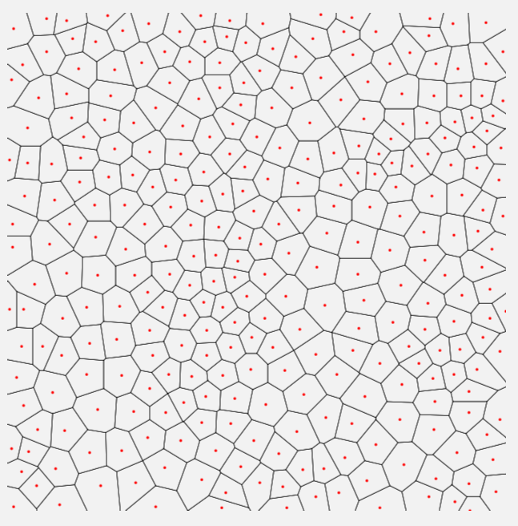

# Assignment A2: Mesh Generator

  - Ali Virk [virka9@mcmaster.ca]
  - Hamza Abou Jaib [aboujaih@mcmaster.ca]
  - Qamrosh Ahmad [ahmadq2@mcmaster.ca]

## Running the generator and visualizer

The following information shows the necessary commands to create a mesh and visualize the mesh in an SVG file. If needed, the mesh can be visualized in debug mode by including a `-X` flag.

Running the commands with no extra arguments will result in a grid mesh composed of squares, where the canvas size is 500x500 with a square size of 20. 

When running the generator, the following arguments can be used to control the mesh generation:

```
java -jar generator/generator.jar generator/sample.mesh -t <mesh type> -d <canvas height> -w <canvas width> -s <square size> -n <number of polygons> -r <relaxation level>
```

To see all possible user configurations, run the above with argument ```-h``` or ```--help```

The following is an example of generating and visualizing a **regular** mesh:

```mvn install```

```java -jar generator/generator.jar generator/sample.mesh -t regular -d 600 -w 600 -s 15```

```java -jar visualizer/visualizer.jar generator/sample.mesh visualizer/sample.svg```

<br>

<br>
Figure 1.0: Regular mesh rendered regularly
<br><br>

```java -jar visualizer/visualizer.jar generator/sample.mesh visualizer/sample.svg -X```

<br>

<br>
Figure 1.1: Regular mesh rendered in debug mode
<br><br>

The following is an example of generating and visualizing an **irregular** mesh:

```mvn install```

```java -jar generator/generator.jar generator/sample.mesh -t irregular -n 300 -r 3```

```java -jar visualizer/visualizer.jar generator/sample.mesh visualizer/sample.svg```

<br>

<br>
Figure 2.0: Irregular mesh rendered regularly
<br><br>

```java -jar visualizer/visualizer.jar generator/sample.mesh visualizer/sample.svg -X```

<br>

<br>
Figure 2.1: Irregular mesh rendered in debug mode
<br><br>

## Generating islands

The following information shows how to transform an existing mesh by generating terrain.

When running the island generator, the following arguments can be used to control the island generation:

```
java -jar island/island.jar -i <mesh input path> -o <mesh output path> --mode <generation mode> --shape <island shape> --altitude <altitude profile> --lakes <max number of lakes> --rivers <number of rivers>
```

To see all possible user configurations, run the above with argument ```-h``` or ```--help```

Pre-made shapes that can be used:  
```--shape circle, --shape ellipse, --shape rectangle, --shape square```

Pre-made altitude profiles that can be used:  
```--altitude centralPeak, --shape cornerPeaks, --shape randomPeaks```

The following is an example of generating and visualizing an island mesh:

```mvn install```

```java -jar generator/generator.jar generator/sample.mesh -t irregular -d 1000 -w 1000 -n 2000```

```java -jar island/island.jar -i generator/sample.mesh -o island/sample.mesh --mode lagoon```

```java -jar visualizer/visualizer.jar island/sample.mesh visualizer/sample.svg```

<br>

<br>
Figure 3.0: Lagoon island visualized regularly
<br><br>

The following is an example of generating and visualizing an ellipse shaped island with four mountains on the edges mesh:
```mvn install```

```java -jar generator/generator.jar generator/sample.mesh -t irregular -d 1000 -w 1000 -n 2000```

```java -jar island/island.jar -i generator/sample.mesh -o island/sample.mesh --shape ellipse --altitude cornerMountains```

```java -jar visualizer/visualizer.jar island/sample.mesh visualizer/sample.svg```
<br>

<br>
Figure 3.1: Ellipse island with 4 mountains/peaks
<br><br>

<br>

<br>
Figure 3.2: Ellipse island with 4 mountains/peaks showing the altitudes (white is highest point, cyan is lowest point)
<br><br>


## How to contribute to the project

When you develop features and enrich the product, remember that you have first to `package` (as in `mvn package`) it so that the `jar` file is re-generated by maven.

## Backlog

### Definition of Done

If a feature works as intended without bugs and the code is clean and concise, it is considered done.

### Product Backlog

|  Id   | Feature title                                                                                                                                 | Who?    | Start     | End       | Status          |
| :---: | --------------------------------------------------------------------------------------------------------------------------------------------- | ------- |-----------|-----------|-----------------|
|  F01  | All squares in the mesh grid are polygons                                                                                                     | Qamrosh | 2/15/2023 | 2/15/2023 | D               |
|  F02  | Polygons includes indexes to all segments, including those shared by neighbours                                                               | Ali     | 2/17/2023 | 2/17/2023 | D               |
|  F03  | Polygons list their segments consecutively                                                                                                    | Qamrosh | 2/15/2023 | 2/15/2023 | D               |
|  F04  | Polygons include an index to their center vertex                                                                                              | Hamza   | 2/17/2023 | 2/17/2023 | D               |
|  F05  | Mesh contains no duplicate vertices, segments, or polygons                                                                                    | Qamrosh | 2/15/2023 | 2/15/2023 | D               |
|  F06  | Vertices, segments, and polygons should have colors and thickness information                                                                 | Ali     | 2/18/2023 | 2/18/2023 | D               |
|  F07  | Debug mode, toggled by -X flag as cmd line argument, shows polygons in black, centroids in red, and neighbourhood relationships in light grey | Hamza   | 2/19/2023 | 2/19/2023 | D               |
|  F08  | Generate random points, one for each expected polygon                                                                                         | Hamza   | 2/23/2023 | 2/23/2023 | D               |
|  F09  | Compute the Voronoi Diagram of the generated points to create a mesh                                                                          | Qamrosh | 2/24/2023 | 2/25/2023 | D               |
|  F10  | Apply and repeat Lloyd relaxation to the mesh until it is smoothened                                                                          | Qamrosh | 2/25/2023 | 2/25/2023 | D               |
|  F11  | Compute neighbourhood relationships using Delaunay’s triangulation                                                                            | Hamza   | 2/25/2023 | 2/26/2023 | D               |
|  F12  | For each irregular polygon, reorder its segments by computing its Convex Hull so that the consecutiveness invariants holds                    | Ali     | 2/26/2023 | 2/26/2023 | D               |
|  F13  | User can control the type of mesh and relevant configurations                                                                                 | Qamrosh | 2/26/2023 | 2/27/2023 | D               |
|  F14  | Introduce a property to differentiate types of polygon tiles as "water and "land" tiles                                                       | Ali     | 2/28/2023 | 3/03/2023 | D               |
|  F15  | Add "lagoon" tiles                                                                                                                            | Hamza   | 3/06/2023 | 3/06/2023 | D               |
|  F16  | Modify tiles on the boundary to be "beach" tiles                                                                                              | Qamrosh | 3/06/2023 | 3/06/2023 | D               |
|  F17  | Implement command line configuration of input and output mesh                                                                                 | Ali     | 2/28/2023 | 3/02/2023 | D               |
|  F18  | Implement user configurable island shapes                                                                                                     | Ali     | 3/13/2023 | 3/13/2023 | D               |
|  F19  | Implement differing altitude for tiles                                                                                                        | Qamrosh | 3/15/2023 | 3/15/2023 | D               |
|  F20  | Allow user to configure altitude profiles                                                                                                     | Hamza   | 3/16/2023 | 3/18/2023 | D               |
|  F21  | Implement water-type tiles as lakes tiles                                                                                                     | Hamza   | 3/20/2023 | 3/22/2023 | D               |
|  F22  | Introduce humidity to tiles near lake tiles                                                                                                   | Ali     | 3/23/2023 | 3/23/2023 | D               |
|  F23  | Vegetation can be influenced by nearby lake tiles                                                                                             | Qamrosh | 3/23/2023 | 3/23/2023 | D               |
|  F24  | The maximum number of lakes can be controlled via command line arguments                                                                      | Hamza   | 3/22/2023 | 3/22/2023 | D               |
|  F25  | Add rivers that start at a random vertex and follow a line of edges                                                                           | Qamrosh | 3/21/2023 | 3/22/2023 | D               |
|  F26  | Rivers stop flowing at lowest point or when an ocean tile is reached                                                                          | Ali     | 3/22/2023 | 3/22/2023 | D               |
|  F27  | Introduce humidity to tiles near the river                                                                                                    | Qamrosh | 3/23/2023 | 3/23/2023 | D               |
|  F28  | Vegetation can be influenced by nearby river tiles                                                                                            | Hamza   | 3/23/2023 | 3/23/2023 | D               |
|  F29  | Implement discharge level, which controls thickness, and adjust it when rivers merge                                                          | Ali     | 3/22/2023 | 3/22/2023 | D               |
|  F30  | The number of rivers can be controlled via command line arguments                                                                             | Qamrosh | 3/22/2023 | 3/22/2023 | D               |
|  F31  | The bigger the river the more the more moisture it brings to the surrounding soil                                                             | Hamza   | 3/23/2023 | 3/23/2023 | D               |
|  F32  | Introduce aquifers (underground bodies of water), located randomly around the island                                                          | Ali     |           |           | P               |
|  F33  | Aquifers bring moisture to surrounding tiles                                                                                                  | Qamrosh |           |           | P               |
|  F34  | The number of aquifers is controlled via command line arguments                                                                               | Hamza   |           |           | B (F32)         |
|  F35  | Soil can absorb humidity/moisture from nearby bodies of water                                                                                 | Ali     |           |           | B (F21/F25/F32) |
|  F36  | The speed at which soil absorbs humidity is dependent on its composition                                                                      | Qamrosh |           |           | B (F35)         |
|  F37  | The absorption profile is decided via a command line argument                                                                                 | Ali     |           |           | B (F36)         |
|  F38  | Group collections of tiles as biomes based on temperature and humidity                                                                        | Hamza   |           |           | B (F22/F27/F35) |
|  F39  | Different biomes should be represented with different colours                                                                                 | Qamrosh |           |           | B (F38)         |
|  F40  | Allow user to configure the island biome                                                                                                      | Ali     |           |           | B (F38)         |
|  F41  | Fetch temperature and humidity information based on user configured biomes                                                                    | Hamza   |           |           | B (F40)         |
|  F42  | Attribute a seed for each random configuration and island generation                                                                          | Qamrosh |           |           | P               |
|  F43  | Allow user to input a seed that will reproduce the same island generation method                                                              | Ali     |           |           | B (F42)         |
